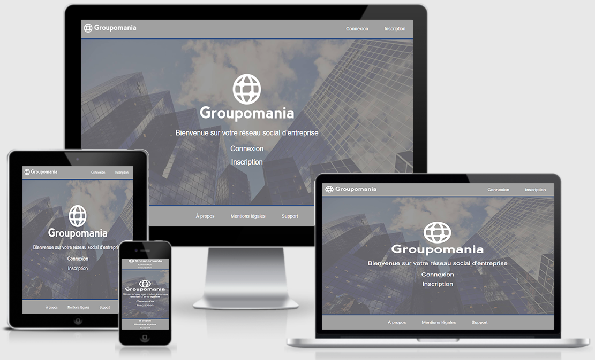

# Projet n°6 : Créer un réseau social d'entreprise (partie front-end)

## :mag: Aperçu

## :bookmark_tabs: Sommaire
<ol>
    <li><a href="#sujet">Sujet</a></li>
    <li><a href="#demandes_respecter">Demandes à respecter</a></li>
    <li><a href="#objectifs_projet">Objectifs du projet</a></li>
    <li><a href="#technologies_utilisees">Technologies utilisées</a></li>
    <li><a href="#prerequis">Prérequis</a></li>
    <li><a href="#installation">Installation</a></li>
    <li><a href="#utilisation_siteweb">Utilisation du site web</a></li>
    <li><a href="#auteurs_contributeurs">Auteurs et contributeurs</a></li>
    <li><a href="#licence">Licence</a></li>
</ol>

## :page_facing_up: 1. Sujet 

Vous êtes développeur depuis plus d'un an chez CONNECT-E, une petite agence web regroupant une douzaine d'employés.

Votre directrice, Stéphanie, invite toute l'agence à prendre un verre pour célébrer une bonne nouvelle ! Elle vient de signer un contrat pour un nouveau projet ambitieux ! 🥂

Le client en question est Groupomania, un groupe spécialisé dans la grande distribution et l'un des plus fidèles clients de l'agence.

Le projet consiste à construire un réseau social interne pour les employés de Groupomania. Le but de cet outil est de faciliter les interactions entre collègues. Le département RH de Groupomania a laissé libre cours à son imagination pour les fonctionnalités du réseau et a imaginé plusieurs briques pour favoriser les échanges entre collègues.

## :memo: 2. Demandes à respecter 

* L’utilisateur doit pouvoir requêter les données requises depuis SQL et soumettre ces changements à la base de données SQL.
* Les données de connexion doivent être sécurisées.
* La web app doit pouvoir se connecter et se déconnecter de l’application.
* La session de l’utilisateur doit persister pendant qu’il est connecté.
* L'utilisation d'un framework pour le front-end, comme par exemple Vue.js, React, est obligatoire.
* Le projet doit être codé en Javascript.
* Les pages doivent respecter les standards WCAG.
* La présentation des fonctionnalités doit être simple.
* L'utilisation du site doit être simple et possible depuis un téléphone mobile.
* Le profil doit contenir très peu d’informations pour que sa complétion soit rapide.
* La suppression du compte doit être possible.
* Les utilisateurs doivent pouvoir publier des contenus multimédias.
* Les utilisateurs doivent pouvoir publier des textes.
* Les utilisateurs doivent pouvoir facilement repérer les dernières participations sur le réseau social.
* Il doit être possible de modérer les interactions des utilisateurs.

## :checkered_flag: 3. Objectifs du projet 

* Apprendre à utiliser Vue.js tout en respectant les bonnes nomenclatures et pratiques.
* Gérer un stockage de données à l'aide de SQL.
* Personnaliser le contenu envoyé à un client web.
* Implémenter un stockage de données sécurisé en utilisant SQL.
* Authentifier un utilisateur et maintenir sa session.

## :computer: 4. Technologies utilisées 

* HTML
* CSS / Sass
* JavaScript / Vue.js
* Photoshop
* Git & GitHub

## :exclamation: 5. Prérequis 

* Avoir Vue.js d'installé sur la machine.
* Avoir fait le necéssaire avec la partie back-end disponible ici : https://github.com/LancelleTimote/TimoteLancelle_7_13102021_backend

## :wrench: 6. Installation 

* Cloner ce repository.
* Pour installer les différents packages, dans le terminal à partir du dossier front-end, exécuter npm install.

## :question: 7. Utilisation du site web 

* Pour démarrer l'application, dans le terminal à partir du dossier front-end, exécuter npm run serve.
* Faire le necéssaire côté back-end.
* Ensuite ouvrir le navigateur et aller sur : http://localhost:8080/

## :beers: 8. Auteurs et Contributeurs 

Timoté Lancelle : [GitHub](https://github.com/LancelleTimote) / [LinkedIn](https://www.linkedin.com/in/timote-lancelle-devweb/)

## :page_with_curl: 9. Licence 

Distribué sous la licence MIT. Voir le fichier [LICENSE](LICENSE) pour plus d'informations.